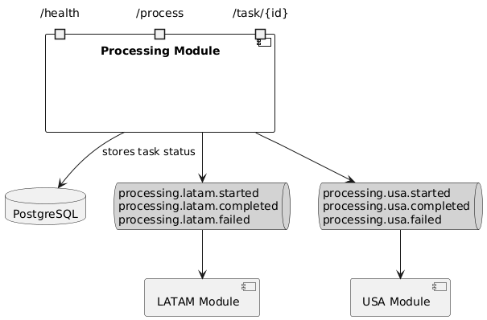
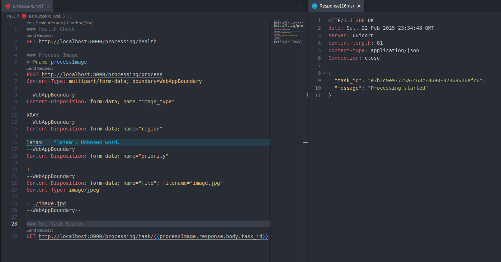
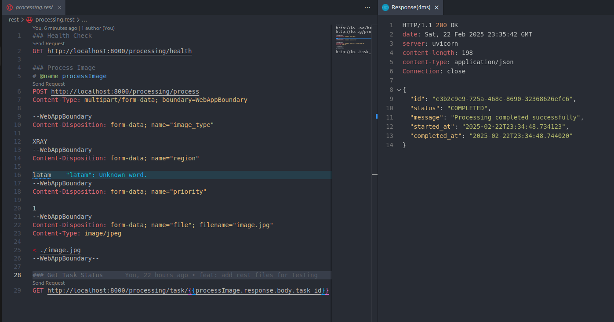
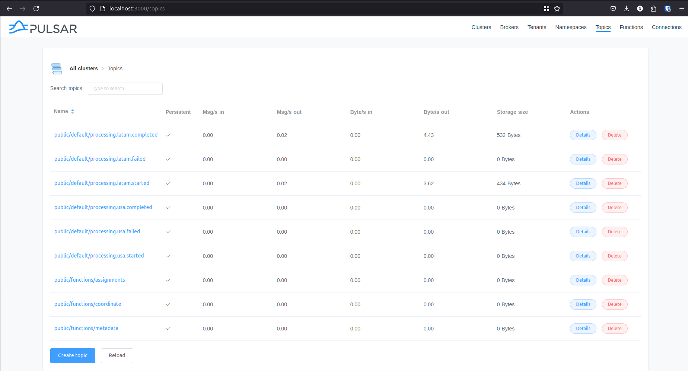

# Processing Service

A processing service implemented following Domain-Driven Design (DDD) principles and event-driven architecture.

## Architecture



The service follows a hexagonal architecture (ports and adapters) with the following key components:

### Domain Layer
- **Entities**: ProcessingTask
- **Value Objects**: ProcessingMetadata, ProcessingResult, ImageType, ProcessingStatus
- **Events**: ProcessingStarted, ProcessingCompleted, ProcessingFailed
- **Repositories**: ProcessingRepository

### Application Layer
- **Commands**: ProcessImageCommand
- **Queries**: GetTaskStatusQuery
- **Event Handlers**: PulsarEventHandler

### Infrastructure Layer
- **Database**: PostgreSQL with SQLAlchemy
- **Message Broker**: Apache Pulsar
- **API**: FastAPI

# Project Structure

```
processing-service/
├── src/
│   └── processing_service/
│       ├── api/                  # API layer
│       ├── config/              # Configuration
│       │   ├── database.py
│       │   └── settings.py
│       ├── modules/             # Business Modules
│       │   ├── processing/      # Main Processing Module
│       │   │   ├── api/        # API Controllers
│       │   │   ├── application/
│       │   │   │   ├── commands/   # Command Handlers
│       │   │   │   ├── queries/    # Query Handlers
│       │   │   │   └── events/     # Event Handlers
│       │   │   ├── domain/     # Domain Model
│       │   │   │   ├── entities.py
│       │   │   │   ├── events.py
│       │   │   │   ├── repositories.py
│       │   │   │   └── value_objects.py
│       │   │   └── infrastructure/
│       │   │       ├── messaging/   # Message Broker
│       │   │       └── persistence/ # Data Access
│       │   ├── latam_processing/    # LATAM Module
│       │   └── usa_processing/      # USA Module
│       └── seedwork/            # Shared Kernel
│           ├── application/     # Base Application
│           ├── domain/         # Base Domain
│           └── infrastructure/ # Base Infrastructure
├── tests/                      # Tests
│   ├── unit/
│   └── integration/
├── docker-compose.yml          # Docker Compose
├── processing.Dockerfile       # Main Service Dockerfile
└── requirements.txt           # Python Dependencies
```

## Quick Start

1. **Prerequisites**
   - Docker and Docker Compose

2. **Run the Service**
   ```bash
   docker-compose up --build
   ```

3. **Access Points**
   - API: http://localhost:8000
   - Pulsar Admin: http://localhost:8080
   - Pulsar Express: http://localhost:3000
   - PostgreSQL: localhost:5432

4. **Test Endpoints**
   - Health Check: `GET /processing/health`
   - Process Image: `POST /processing/process`
   - Get Task Status: `GET /task/{task_id}`
  
## Test

- Install [REST Client VSCode Extension](https://marketplace.visualstudio.com/items?itemName=humao.rest-client)
- Open the file rest/processing.rest and send requests





# Start server locally (Optional)

```sh
uvicorn src.processing_service.main:app --reload --host 0.0.0.0 --port 8000
```